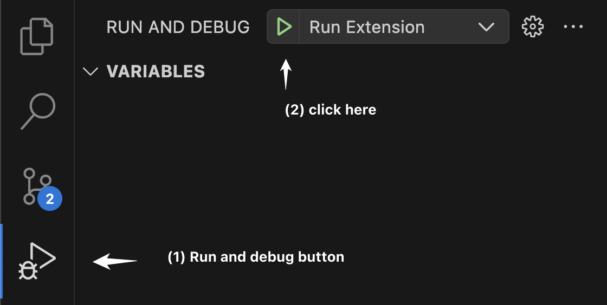

### Requirements
* `node v18` or higher
* `npm` (gets installed alongside node)

### How to contribute

#### Build the project

1. To build and make changes to the extension
    - Fork this repository, clone it to your desktop and open it in VSCode 
    - Run `npm install` in your terminal to install all the dependencies
    - Click the `Run and debug` icon on the left hand pane of your editor and click on `Run Extension` button. 

        

2. Doing step (1) will open a new VSCode window where you can open a Dataform project. Make sure that you folder opened in the workspace is at the root of the Dataform project. For example if your Dataform project is located at `~/repos/my_dataform_project` open the workspace at `~/repos/my_dataform_project`, **NOT** `~/repos`. Such that either `workflow_settings.yaml` or `dataform.json` depending on the Dataform version you are using is located at the root of the VSCode workspace.

#### Make your changes

3. Make the desired changes to the `vscode-dataform-tools` repo and re-run/refresh the compilation to see the desired outcome in the new VSCode window that opens when doing step (2)

#### Test your changes

4. **Test your changes** on your Dataform repository. If you are running linux based operating system run `npm run test` on your terminal to verify if the exsisiting tests are pasing. There are some caveats with running tests, so do not panic if the test fail to run. The test would not be able to run if your project path is very long this is a [known issue reported here](https://github.com/microsoft/vscode-test/issues/232). Also, we are having to remove `.vscode-test/user-data` before running `vscode-test` in the `npm run test` script in `package.json`. These tests currently are only tested to be running on Mac OS. We will need to change the script for `npm run test` in `package.json` for it to work in multiple operating systems.

#### Open an issue / pull request

5. If you'd like the feature or bug fix to be merged
    - Check the exsisting issues to make sure that if it has not been already raised
    - [Create an issue here](https://github.com/ashish10alex/vscode-dataform-tools/issues)  
    - [Create a pull request here](https://github.com/ashish10alex/vscode-dataform-tools/pulls)