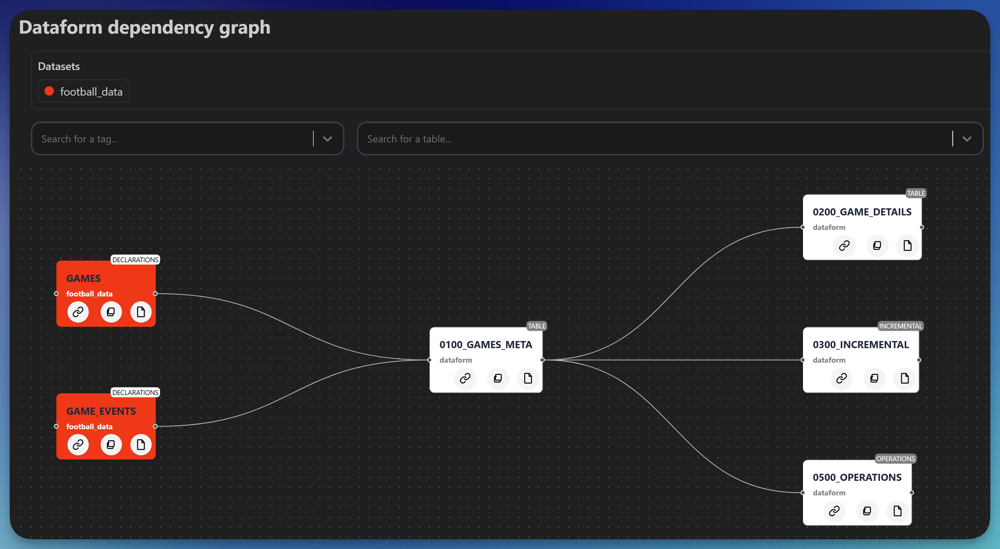

# Dataform tools - a vscode extension

> ▶️ [Click here for YouTube video with installation steps and demo →](https://www.youtube.com/watch?v=nb_OFh6YgOc)

[VS Code extension](https://marketplace.visualstudio.com/items?itemName=ashishalex.dataform-lsp-vscode) for [Dataform](https://github.com/dataform-co/dataform). Supports both Dataform version 2.x and 3.x and works in VS Code forks such as Cursor & Antigravity.
✨ **Officially recommended by Google[^1]** ✨. Though not an officially supported Google product.

<picture>
  <source media="(prefers-color-scheme: dark)" srcset="media/images/compiled_query_preview_dark.png">
  <source media="(prefers-color-scheme: light)" srcset="media/images/compiled_query_preview_light.png">
  <!-- Fallback image if picture is not supported -->
  
</picture>


<table>
  <thead>
    <tr>
      <th>Support the project</th>
      <th>
      <a href="https://buymeacoffee.com/ashishalexj">
         
      </a>
       </th>
    </tr>
    <tr>
      <th>Supported Operating Systems</th>
      <th>
         
         
         
      </th>
    </tr>
  </thead>
</table>

----

## Installation

1. Install the extension from the marketplace.
2. [Install Dataform cli](https://cloud.google.com/dataform/docs/use-dataform-cli)

   ```bash
   # requires nodejs & npm - https://nodejs.org/en/download
   npm i -g @dataform/cli
   ```
   Run `dataform compile` from the root of your Dataform project to ensure that you are able to use the cli.

3. [Install gcloud cli](https://cloud.google.com/sdk/docs/install) and run

   ```bash
   gcloud init
   gcloud auth application-default login
   gcloud config set project <project_id> #replace with your gcp project id
   ```

4. [Install sqlfluff](https://github.com/sqlfluff/sqlfluff) (optional, for formatting)

   ```bash
   # install python and run
   pip install sqlfluff
   ```

> [!NOTE]
> Trouble installing or looking for a specific customization ? Please see [FAQ section](FAQ.md), if you are still stuck, please [raise an issue here](https://github.com/ashish10alex/vscode-dataform-tools/issues)

* ️▶️ [Installation on Windows](https://www.youtube.com/watch?v=8AsSwzmzhV4)
* ️▶️ [Installation and demo on Ubuntu](https://www.youtube.com/watch?v=nb_OFh6YgOc)
* ️▶️ [Dataform workpace run using API demo and technical details](https://youtu.be/7Tt7KdssW3I?si=MjHukF26Y19kBPkj)

----

## ✨ Features / Previews

| Feature | Description |
|---------|-------------|
| [Compiled Query & Dry run stats](#compilation) | Compiled query with dry run stats in a vertical split |
| [Inline diagnostics on `.sqlx` file](#diagnostics) 🚨 | Native LSP like experience with diagnostics being directly put on sqlx file |
| [Dependancy graph](#depgraph) | Interative dependancy graph with external sources higlighted in distinct colors |
| [Preview query results](#preview_query_results) | Preview query results in a table by running the file |
| [Cost estimator](#cost_estimator) 💸 | Estimate the cost of running a Tag|
| [Go to definition](#definition) | Go to definition for source in `$ref{("my_source")}` and javascript blocks in `.sqlx` files  |
| [Auto-completion](#autocomplete) | - Column names of current model <br> - Dependencies and declarations in `${ref("..")}` trigger when `$` character is typed <br> - Dependencies when `"` or `'` is typed inside the config block which has `dependencies` keyword is in the line prefix <br> - `tags` when `"` or `'` is typed inside the config block which has `tags` keyword is in the line prefix |
| [Code actions](#codeactions) | Apply dry run suggestions at the speed of thought |
| [Run file(s)/tag(s)](#filetagruns) | Run file(s)/tag(s), optionally with dependencies/dependents/full refresh using cli or [Dataform API](https://cloud.google.com/nodejs/docs/reference/dataform/latest/dataform/v1beta1.dataformclient) |
| [Format using Sqlfluff](#formatting) 🪄 | Fromat `.sqlx` files using [sqlfluff](https://github.com/sqlfluff/sqlfluff)|
| [BigQuery snippets](#snippets) | Code snippets for generic BigQuery functions taken from [vscode-langauge-sql-bigquery](https://github.com/shinichi-takii/vscode-language-sql-bigquery) extension |
| [BigQuery hover definition provider](#hover) | Hover definition for column descriptions, type and commonly used BigQuery functions |


### <a id="diagnostics">Inline diagnostics errors on `.sqlx` files ❗</a>

<picture>
  <source media="(prefers-color-scheme: dark)" srcset="media/images/diagnostics_dark.png">
  <source media="(prefers-color-scheme: light)" srcset="media/images/diagnostics_light.png">
  <!-- Fallback image if picture is not supported -->
  
</picture>

### <a id="depgraph">Dependency graph</a>

<picture>
  <source media="(prefers-color-scheme: dark)" srcset="media/images/dependancy_tree_dark.png">
  <source media="(prefers-color-scheme: light)" srcset="media/images/dependancy_tree_light.png">
  <!-- Fallback image if picture is not supported -->
  
</picture>


### <a id="preview_query_results">Preview query results</a>

<!--  -->
<picture>
  <source media="(prefers-color-scheme: dark)" srcset="media/images/preview_query_results_dark.png">
  <source media="(prefers-color-scheme: light)" srcset="media/images/preview_query_results_light.png">
  <!-- Fallback image if picture is not supported -->
  
</picture>

### <a id="cost_estimator">Estimate cost of running a Tag</a>

<picture>
  <source media="(prefers-color-scheme: dark)" srcset="media/images/tag_cost_estimator_dark.png">
  <source media="(prefers-color-scheme: light)" srcset="media/images/tag_cost_estimator_light.png">
  <!-- Fallback image if picture is not supported -->
  
</picture>

### <a id="definition">Go to definition</a>

Go to definition for source in `$ref{("my_source")}`. Takes you to `my_source.sqlx` or `sources.js` at the line where `my_source` is defined. There is also support for go to definiton
from a javascript variable/module from a `.sqlx` file to `js` block or `.js` file where the virable or module declaration exsists


### <a id="autocomplete">Autocomplete model, tags, dependencies</a>

Auto completion of declarations in `${ref("..")}` trigger when <kdb>$<kdb> character is typed and `dependencies` and `tags` in config block when `"` or `'` is typed.


### <a id="formatting">Formatting using sqlfluff</a>


### <a id="hover">BigQuery hover definition provider</a>

Hover over BigQuery functions to see their documentation, syntax, and examples making it easier to understand and use them correctly without leaving your editor.


----


## Commands

Most features can be invoked via command pallet by pressing <kbd>CTLR</kbd> + <kbd>SHIFT</kbd> + <kbd>p</kbd> or <kbd>CMD</kbd> + <kbd>SHIFT</kbd> + <kbd>p</kbd> on mac and searching for the following. These key bindings can also be attached to a keybinding to
further streamline your workflow.

| Command | Description |
|---------|-------------|
| `vscode-dataform-tools.showCompiledQueryInWebView` | Show compiled Query in web view |
| `vscode-dataform-tools.runCurrentFile` | Run current file |
| `vscode-dataform-tools.runCurrentFileWtDeps` | Run current file with dependencies |
| `vscode-dataform-tools.runCurrentFileWtDownstreamDeps` | Run current file with dependents |
| `vscode-dataform-tools.runQuery` | Preview query results |
| `vscode-dataform-tools.runTag` | Run a tag |
| `vscode-dataform-tools.runTagWtDeps` | Run a tag with dependencies |
| `vscode-dataform-tools.runTagWtDownstreamDeps` | Run a tag with dependents |
| `vscode-dataform-tools.runFilesTagsWtOptions` | Run file(s) / tag(s) with options |
| `vscode-dataform-tools.runFilesTagsWtOptionsApi` | Run file(s) / tag(s) with options using API |
| `vscode-dataform-tools.runFilesTagsWtOptionsInRemoteWorkspace` | Run file(s) / tag(s) with options using API in remote workspace [beta] |
| `vscode-dataform-tools.dependencyGraphPanel` | Show dependency graph |
| `vscode-dataform-tools.runTagWtApi` | Run a tag using API |
| `vscode-dataform-tools.runTagWtDependenciesApi` | Run tag with dependencies using API |
| `vscode-dataform-tools.runCurrentFileWtApi` | Run current file using API |
| `vscode-dataform-tools.runCurrentFileWtDependenciesApi` | Run current file with dependencies using API |
| `vscode-dataform-tools.runCurrentFileWtDependentsApi` | Run current file with dependents using API |
| `vscode-dataform-tools.clearExtensionCache` |  Clear extension cache|

----

## Products

<table>
  <thead>
    <tr>
      <th>Registry</th>
      <th>Badge </th>
      <th>Description</th>
    </tr>
  </thead>
  <tbody>
    <tr>
      <td><a href="https://marketplace.visualstudio.com/items?itemName=ashishalex.dataform-lsp-vscode">VS Code marketplace</a></td>
      <td>
      
      </td>
      </td>
      <a href="https://marketplace.visualstudio.com/items?itemName=ashishalex.dataform-lsp-vscode"></a>
      </td>
      <td>Marketplace for VS Code editor</td>
    </tr>
    <tr>
      <td><a href="https://open-vsx.org/extension/ashishalex/dataform-lsp-vscode">Open VSX marketplace</a></td>
      <td>
      
      
      </td>
      <a href="https://open-vsx.org/extension/ashishalex/dataform-lsp-vscode"></a>
      <td>Marketplace for VS Code forks such as <a href="https://cursor.com">Cursor</a></td>
    </tr>
    <tr>
      <td> <a href="https://pypi.org/project/dataform-tools/">PyPi</a></td>
      <td></td>
      <a href="https://pypi.org/project/dataform-tools/"></a>
      <td>wrapper for google-cloud-dataform python pacakge</td>
    </tr>
    <tr>
      <td> <a href="https://www.npmjs.com/package/@ashishalex/dataform-tools">npm</a></td>
      <td></td>
      <a href="https://www.npmjs.com/package/@ashishalex/dataform-tools"></a>
      <td>wrapper for google-cloud/dataform npm package </td>
    </tr>
  </tbody>
</table>

----

## Known Issues

* [ ] Features such as go to definition / dependancy graph might not work with consistantly with `${ref("dataset", "table")}` or when it is multiline or a different format works best with `${ref('table_name')}` format

## TODO

* [ ] Add option to include dependents / dependencies when running cost estimator for tag
* [ ] Add hover docs for config block elements. e.g. Assertions, type etc
* [ ] Handle case where user is not connected to internet or on vpn where network request for dry run cannot be made

[^1]: [Link to confirmation of official recommendation by Google:](https://github.com/dataform-co/dataform/blob/main/vscode/README.md)
