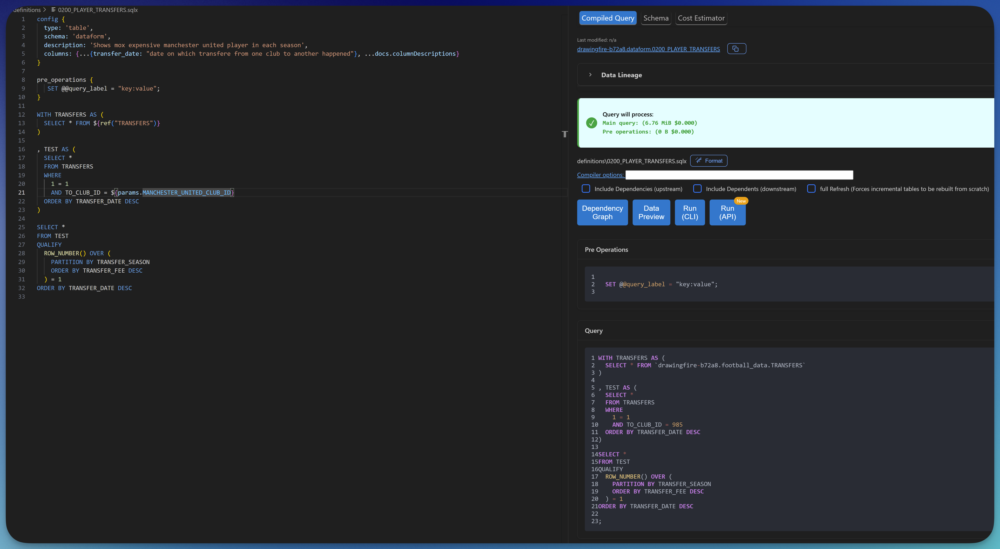

# Dataform tools - a vscode extension

🎥 [Click here for YouTube video with installation steps and demo →](https://www.youtube.com/watch?v=nb_OFh6YgOc)

[](https://github.com/ashish10alex/vscode-dataform-tools/releases)


[](https://buymeacoffee.com/ashishalexj)

🎉 **Officially recommended by Google[^1]**. Though not an officially supported Google product.

[VS Code extension](https://marketplace.visualstudio.com/items?itemName=ashishalex.dataform-lsp-vscode) for [Dataform](https://github.com/dataform-co/dataform). Supports both Dataform version 2.x and 3.x

| Feature | Description |
|---------|-------------|
| [Compiled Query & Dry run stats](#compilation) | Compiled query with dry run stats in a vertical split |
| [Dependancy graph](#depgraph) | Interative dependancy graph with external sources higlighted in distinct colors |
| [Inline diagnostics on `.sqlx` file](#diagnostics) 🚨 | Native LSP like experience with diagnostics being directly put on sqlx file |
| [Preview query results](#preview_query_results) | Preview query results in a table by running the file |
| [Schema code generation](#schema_code_gen) | Edit the schema of the model to genrate code that can be used for documentation |
| [Cost estimator](#cost_estimator) 💸 | Estimate the cost of running a Tag|
| [Go to definition](#definition) | Go to definition for source in `$ref{("my_source")}` and javascript blocks in `.sqlx` files  |
| [Auto-completion](#autocomplete) | - Column names of current model <br> - Dependencies and declarations in `${ref("..")}` trigger when `$` character is typed <br> - Dependencies when `"` or `'` is typed inside the config block which has `dependencies` keyword is in the line prefix <br> - `tags` when `"` or `'` is typed inside the config block which has `tags` keyword is in the line prefix |
| [Code actions](#codeactions) | Apply dry run suggestions at the speed of thought |
| [Run file(s)/tag(s)](#filetagruns) | Run file(s)/tag(s), optionally with dependencies/dependents/full refresh using vscode command pallet or compiled query web view |
| [Format using Sqlfluff](#formatting) 🪄 | Fromat `.sqlx` files using [sqlfluff](https://github.com/sqlfluff/sqlfluff)|
| [BigQuery snippets](#snippets) | Code snippets for generic BigQuery functions taken from [vscode-langauge-sql-bigquery](https://github.com/shinichi-takii/vscode-language-sql-bigquery) extension |
| [BigQuery hover definition provider](#hover) | Hover definition for commonly used BigQuery functions |

## Requirements

1. [Dataform cli](https://cloud.google.com/dataform/docs/use-dataform-cli)

   ```bash
   # requires nodejs
   npm i -g @dataform/cli
   ```

   Run `dataform compile` from the root of your Dataform project to ensure that you are able to use the cli

2. [Install gcloud cli](https://cloud.google.com/sdk/docs/install) and run

   ```bash
   gcloud init
   ```

   ```bash
   gcloud auth application-default login
   ```

   ```bash
    gcloud config set project <project_id> #replace with your gcp project id
   ```

3. To enable formatting using [sqlfluff](https://github.com/sqlfluff/sqlfluff) install [sqlfluff](https://github.com/sqlfluff/sqlfluff)

   ```bash
   # install python and run
   pip install sqlfluff
   ```

4. To enable prettier diagnostics install [Error Lens](https://marketplace.visualstudio.com/items?itemName=usernamehw.errorlens) extension [ **optional** ]

> [!NOTE]
Trouble installing or looking for a specific customization ? Please see [FAQ section](FAQ.md), if you are still stuck, please [raise an issue here](https://github.com/ashish10alex/vscode-dataform-tools/issues)

* 🎥 [Installation on Windows](https://www.youtube.com/watch?v=8AsSwzmzhV4)
* 🎥 [Installation and demo on Ubuntu](https://www.youtube.com/watch?v=nb_OFh6YgOc)

## Features

### <a id="compilation">Compiled query & Dry run stats</a>



### <a id="depgraph">Dependency graph</a>


### <a id="diagnostics">Inline diagnostics errors on `.sqlx` files ❗</a>


### <a id="preview_query_results">Preview query results</a>


### <a id="schema_code_gen">Schema code generation</a>

Generate code for schema of the model by editing description to generate documentation code for the columns. See <a href="https://cloud.google.com/dataform/docs/create-tables#reuse-column-documentation-includes">documentation</a> for how to use the generated code


### <a id="cost_estimator">Estimate cost of running a Tag</a>


### <a id="definition">Go to definition</a>

Go to definition for source in `$ref{("my_source")}`. Takes you to `my_source.sqlx` or `sources.js` at the line where `my_source` is defined. There is also support for go to definiton
from a javascript variable/module from a `.sqlx` file to `js` block or `.js` file where the virable or module declaration exsists


### <a id="autocomplete">Autocomplete model, tags, dependencies</a>

Auto completion of declarations in `${ref("..")}` trigger when <kdb>$<kdb> character is typed and `dependencies` and `tags` in config block when `"` or `'` is typed.


### <a id="formatting">Formatting using sqlfluff</a>


### <a id="hover">BigQuery hover definition provider</a>

Hover over BigQuery functions to see their documentation, syntax, and examples making it easier to understand and use them correctly without leaving your editor.


## Commands

Most features can be invoked via command pallet by pressing <kbd>CTLR</kbd> + <kbd>SHIFT</kbd> + <kbd>p</kbd> or <kbd>CMD</kbd> + <kbd>SHIFT</kbd> + <kbd>p</kbd> on mac and searching for the following. These key bindings can also be attached to a keybinding to
further streamline your workflow.

| Command | Description |
|---------|-------------|
| `vscode-dataform-tools.showCompiledQueryInWebView` | Show compiled Query in web view |
| `vscode-dataform-tools.runCurrentFile` | Run current file |
| `vscode-dataform-tools.runCurrentFileWtDeps` | Run current file with dependencies |
| `vscode-dataform-tools.runCurrentFileWtDownstreamDeps` | Run current file with dependents |
| `vscode-dataform-tools.runQuery` | Preview query results |
| `vscode-dataform-tools.runTag` | Run a tag |
| `vscode-dataform-tools.runTagWtDeps` | Run a tag with dependencies |
| `vscode-dataform-tools.runTagWtDownstreamDeps` | Run a tag with dependents |
| `vscode-dataform-tools.runFilesTagsWtOptions` | Run file(s) / tag(s) with options |
| `vscode-dataform-tools.dependencyGraphPanel` | Show dependency graph |
| `vscode-dataform-tools.formatDocument` | Format Document |

## Known Issues

* [ ] Features such as go to definition / dependancy graph might not work with consistantly with `${ref("dataset", "table")}` or when it is multiline or a different format works best with `${ref('table_name')}` format

## TODO

* [ ] Add option to include dependents / dependencies when running cost estimator for tag
* [ ] Add hover docs for config block elements. e.g. Assertions, type etc
* [ ] Handle case where user is not connected to internet or on vpn where network request for dry run cannot be made

[^1]: Link to confirmation of official recommendation by Google:  [link](https://github.com/dataform-co/dataform/blob/main/vscode/README.md)
